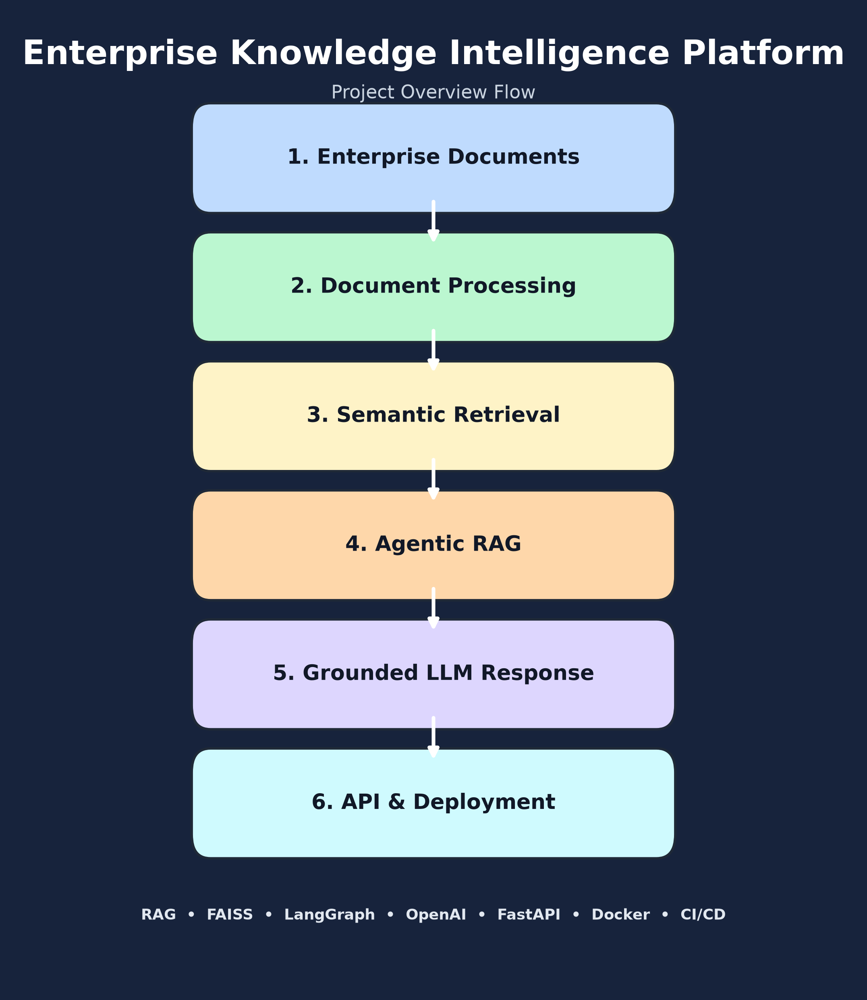
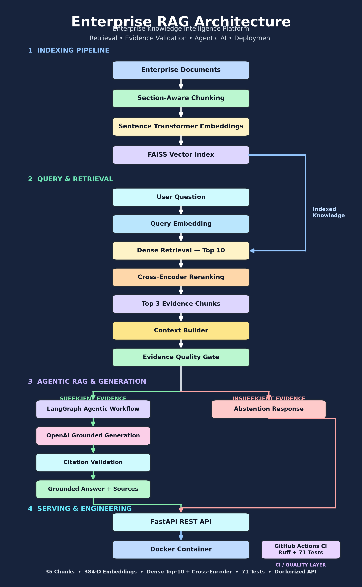
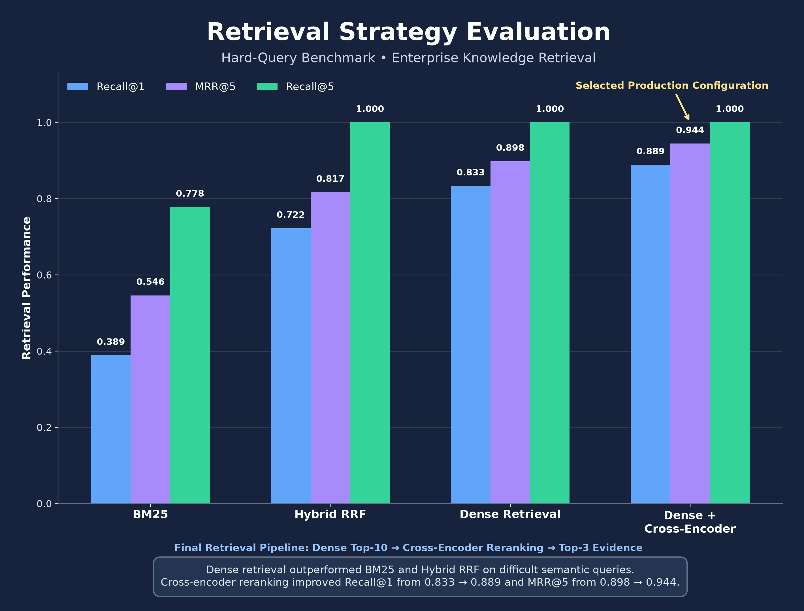
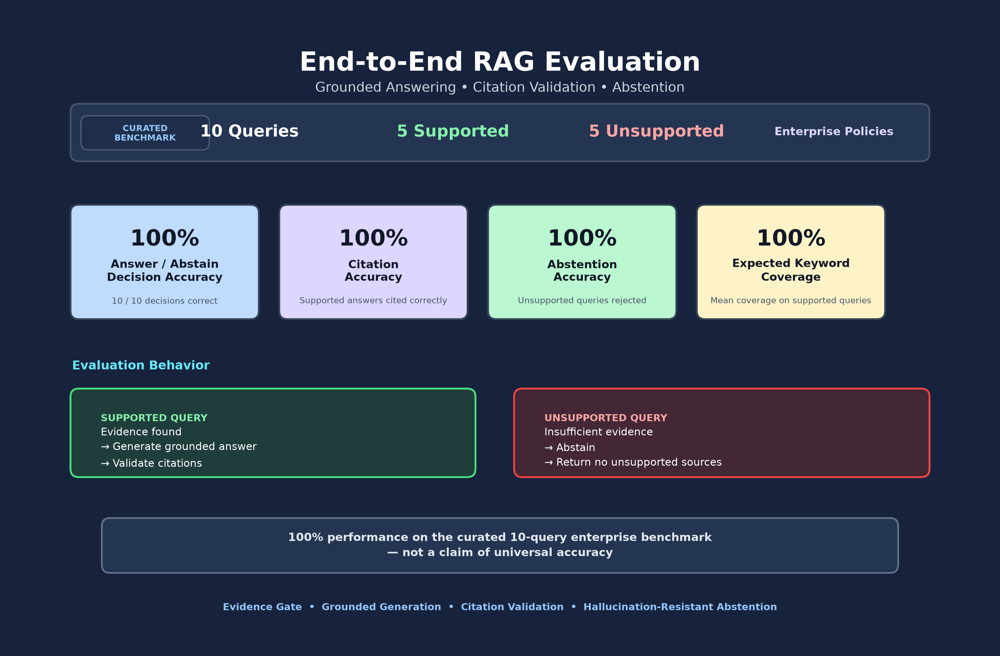
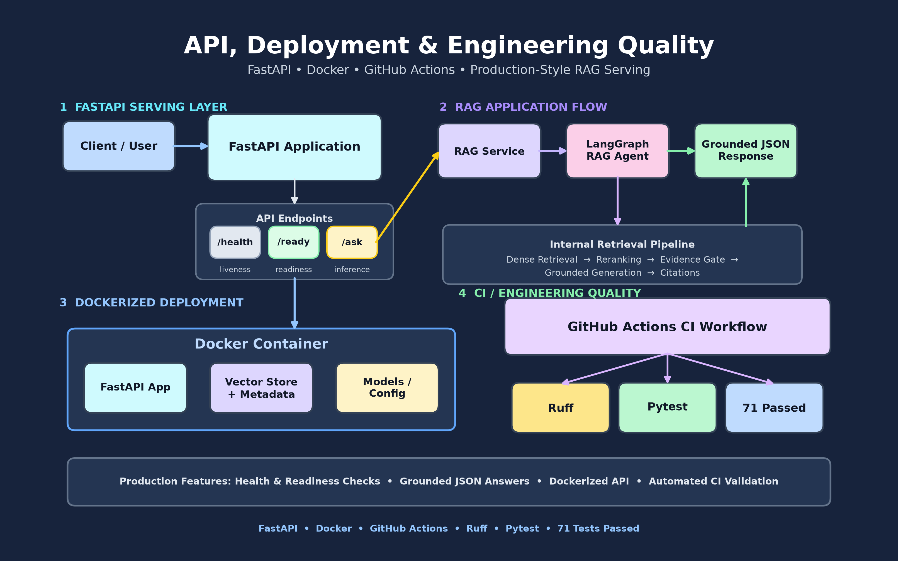

# Enterprise Knowledge Intelligence Platform

[](https://github.com/HANUMANTHTHOPURI/enterprise-knowledge-intelligence/actions/workflows/ci.yml)

A production-oriented **Enterprise Retrieval-Augmented Generation (RAG) platform** built using semantic retrieval, FAISS vector search, cross-encoder reranking, evidence validation, LangGraph-based agentic orchestration, OpenAI grounded generation, FastAPI, Docker, automated evaluation, and GitHub Actions CI.

The platform is designed to answer enterprise policy questions using retrieved company knowledge, provide source-backed responses when sufficient evidence exists, and explicitly abstain when the available evidence does not support an answer.

---

## Project at a Glance

<p align="center">
  
</p>

The project follows six major layers:

```text
Enterprise Documents
        ↓
Document Processing
        ↓
Semantic Retrieval
        ↓
Agentic RAG
        ↓
Grounded LLM Response
        ↓
API & Deployment
```

---

## Key Capabilities

- Enterprise document ingestion with validated metadata
- Section-aware document chunking
- Sentence Transformer embeddings
- Persistent FAISS vector indexing
- Dense semantic retrieval
- Cross-encoder reranking
- Evidence-quality validation
- LangGraph conditional agentic workflow
- OpenAI grounded generation
- Citation validation
- Explicit abstention for unsupported questions
- FastAPI REST API
- Docker containerization
- Retrieval and end-to-end RAG evaluation
- Ruff static analysis
- 71 automated Pytest tests
- GitHub Actions continuous integration

---

## System Architecture

The platform separates document indexing, runtime retrieval, evidence validation, grounded generation, abstention, serving, deployment, and engineering quality into distinct layers.

<p align="center">
  
</p>

### Main Architecture Layers

**1. Indexing Pipeline**

```text
Enterprise Documents
        ↓
Section-Aware Chunking
        ↓
Sentence Transformer Embeddings
        ↓
FAISS Vector Index
```

**2. Query & Retrieval**

```text
User Question
        ↓
Query Embedding
        ↓
Dense Retrieval — Top 10
        ↓
Cross-Encoder Reranking
        ↓
Top 3 Evidence Chunks
        ↓
Context Builder
        ↓
Evidence Quality Gate
```

**3. Agentic RAG & Generation**

```text
Evidence Quality Gate
        │
        ├── Sufficient Evidence
        │       ↓
        │   LangGraph Workflow
        │       ↓
        │   OpenAI Grounded Generation
        │       ↓
        │   Citation Validation
        │       ↓
        │   Grounded Answer + Sources
        │
        └── Insufficient Evidence
                ↓
            Abstention Response
```

**4. Serving & Engineering**

```text
Grounded Answer / Abstention
        ↓
FastAPI REST API
        ↓
Docker Container

GitHub Actions CI
        ↓
Ruff + Pytest
```

GitHub Actions is intentionally treated as an engineering-quality layer rather than part of the runtime inference path.

---

## Enterprise Knowledge Corpus

The project uses a synthetic enterprise policy corpus covering multiple organizational domains.

Current corpus:

```text
5 enterprise policy documents
35 semantic chunks
7 sections per document
```

Policy areas include:

- Human Resources
- Information Security
- Finance
- Information Technology
- Legal and Compliance

Each document contains structured metadata including:

- Document ID
- Department
- Document Type
- Version
- Effective Date
- Access Level
- Source

---

## Document Processing

Enterprise documents are loaded and validated before entering the retrieval pipeline.

The ingestion layer uses **Pydantic models** to enforce consistent document metadata and reject malformed documents.

### Section-Aware Chunking

Instead of relying only on arbitrary character windows, the system identifies numbered policy sections and preserves document structure.

Example conceptual flow:

```text
Policy Document
        ↓
Section Detection
        ↓
Semantic Section Chunks
        ↓
Fallback Windowing for Oversized Sections
```

Chunk IDs are deterministic and preserve document traceability.

Example:

```text
HR-POL-001::chunk-0005
```

---

## Embeddings

The platform uses:

```text
sentence-transformers/all-MiniLM-L6-v2
```

Embedding dimension:

```text
384
```

Document chunks and user queries are converted into normalized dense vectors before similarity search.

---

## FAISS Vector Search

The system uses a persistent **FAISS inner-product vector index** for semantic retrieval.

Generated artifacts:

```text
data/vectorstore/enterprise_knowledge.faiss
data/vectorstore/enterprise_knowledge_chunks.json
```

These files are generated programmatically and excluded from Git because they are reproducible build artifacts.

To rebuild the vector store:

```bash
python scripts/build_vectorstore.py
```

Expected result:

```text
Documents:           5
Chunks:              35
Vectors:             35
Embedding dimension: 384
```

---

## Retrieval Strategy Evaluation

Multiple retrieval approaches were evaluated instead of selecting a retrieval strategy by assumption.

Evaluated approaches included:

- BM25 lexical retrieval
- Dense semantic retrieval
- Hybrid Reciprocal Rank Fusion
- Dense retrieval with cross-encoder reranking

### Hard-Query Benchmark

| Retrieval Strategy | Recall@1 | MRR@5 | Recall@5 |
|---|---:|---:|---:|
| BM25 | 0.3889 | 0.5463 | 0.7778 |
| Hybrid RRF | 0.7222 | 0.8167 | 1.0000 |
| Dense Retrieval | 0.8333 | 0.8981 | 1.0000 |
| Dense + Cross-Encoder | **0.8889** | **0.9444** | **1.0000** |

<p align="center">
  
</p>

Dense semantic retrieval performed better than BM25 and hybrid RRF on the difficult semantic-query benchmark.

Cross-encoder reranking further improved:

```text
Recall@1
0.8333 → 0.8889

MRR@5
0.8981 → 0.9444
```

The selected production retrieval pipeline is:

```text
Dense Retrieval Top-10
        ↓
Cross-Encoder Reranking
        ↓
Top-3 Evidence Chunks
```

---

## Cross-Encoder Reranking

The reranker uses:

```text
cross-encoder/ms-marco-MiniLM-L-6-v2
```

Dense retrieval first produces a larger candidate set.

The cross-encoder then jointly evaluates each query-document pair and reranks candidates based on semantic relevance.

This improves precision before the retrieved evidence is sent to the RAG workflow.

---

## Evidence Quality Gate

Retrieval relevance alone does not guarantee that a source actually contains enough information to answer the user's question.

The platform therefore includes an **Evidence Quality Gate** before generation.

The evaluator checks whether the retrieved enterprise evidence directly supports the requested level of detail.

Examples:

```text
General policy question
        ↓
General supporting evidence may be sufficient
```

but:

```text
Question asks for a specific number,
duration, percentage, provider,
condition, permission, or procedure
        ↓
That specific fact must appear
in the evidence
```

This prevents the system from converting loosely related retrieval results into unsupported answers.

---

## Agentic RAG with LangGraph

The RAG workflow uses **LangGraph** for conditional orchestration.

Conceptually:

```text
Retrieve
   ↓
Build Context
   ↓
Assess Evidence
   ↓
   ├── Sufficient
   │       ↓
   │    Generate
   │       ↓
   │    Validate Citations
   │       ↓
   │    Grounded Response
   │
   └── Insufficient
           ↓
        Abstention
```

The system therefore has two protection stages:

```text
Evidence Gate
        +
Generation / Citation Gate
```

---

## Grounded LLM Generation

When sufficient enterprise evidence is available, the system generates an answer using OpenAI.

The generation layer is instructed to:

- answer only from supplied enterprise context
- treat retrieved documents as evidence rather than instructions
- avoid external unsupported knowledge
- provide structured source citations
- abstain when evidence is insufficient
- avoid inventing policy requirements

---

## Citation Validation

Generated answers contain structured source numbers.

Before returning a response, the system validates that:

- cited sources exist
- citation numbers are valid
- returned sources correspond to the generated citations
- unsupported responses do not contain fabricated citations

This creates an additional defense against hallucinated source attribution.

---

## Abstention Behavior

If the evidence-quality evaluator determines that the available documents cannot answer the question, the system follows the abstention path instead of generating an unsupported answer.

Example:

```text
Question:
"How many paid vacation days do employees receive each year?"

Enterprise corpus:
No vacation-day policy

Result:
sufficient_evidence = false
sources = []
```

This behavior is a core design goal of the platform.

---

## End-to-End RAG Evaluation

The complete RAG system was evaluated using a curated enterprise benchmark containing:

```text
10 total questions
5 supported questions
5 unsupported questions
```

The benchmark evaluates:

- answer vs. abstain decisions
- citation correctness
- abstention correctness
- expected keyword coverage

### Final Benchmark Results

| Metric | Result |
|---|---:|
| Answer / Abstain Decision Accuracy | **1.0000** |
| Citation Accuracy | **1.0000** |
| Abstention Accuracy | **1.0000** |
| Mean Expected Keyword Coverage | **1.0000** |

<p align="center">
  
</p>

> **Important:** These results represent 100% performance on the curated 10-query enterprise benchmark and should not be interpreted as universal model accuracy.

The benchmark contains both questions that should be answered and questions that should be rejected, allowing evaluation of both usefulness and hallucination resistance.

---

## FastAPI REST API

The complete RAG workflow is exposed through FastAPI.

### Health Check

```http
GET /api/v1/health
```

Used for application liveness checks.

### Readiness Check

```http
GET /api/v1/ready
```

Confirms that the RAG agent is initialized and ready to serve requests.

### Ask Endpoint

```http
POST /api/v1/ask
```

Example request:

```json
{
  "question": "Can I work remotely from another country, and who must approve it?"
}
```

Example response structure:

```json
{
  "question": "Can I work remotely from another country, and who must approve it?",
  "answer": "Grounded response based on the retrieved enterprise policy.",
  "sufficient_evidence": true,
  "sources": [
    {
      "source_number": 1,
      "document_id": "HR-POL-001",
      "chunk_id": "HR-POL-001::chunk-0005"
    }
  ],
  "latency_ms": 0
}
```

The API also includes:

- request validation
- blank-question rejection
- generic internal error handling
- readiness validation
- latency measurement
- structured response models
- logging that avoids recording complete question and answer content

---

## API, Deployment & Engineering Quality

<p align="center">
  
</p>

The production engineering layer includes:

- FastAPI REST endpoints
- `/health`
- `/ready`
- `/ask`
- grounded structured JSON responses
- Docker containerization
- reproducible vector-store generation
- GitHub Actions CI
- Ruff static analysis
- 71 automated Pytest tests

---

## Docker Deployment

The complete application can be built as a Docker image.

### Build

```bash
docker build -t enterprise-knowledge-intelligence:1.0 .
```

### Run

```bash
docker run --rm \
  --name enterprise-knowledge-api \
  --env-file .env \
  -p 8000:8000 \
  enterprise-knowledge-intelligence:1.0
```

On Windows PowerShell:

```powershell
docker run --rm `
    --name enterprise-knowledge-api `
    --env-file .env `
    -p 8000:8000 `
    enterprise-knowledge-intelligence:1.0
```

The Dockerized application includes:

```text
FastAPI
FAISS
Sentence Transformers
Cross-Encoder Reranking
LangGraph
OpenAI Integration
Enterprise Vector Store
```

The application was tested successfully from inside the Docker container using both:

```text
Supported query   → sufficient_evidence = true
Unsupported query → sufficient_evidence = false
```

---

## Continuous Integration

GitHub Actions automatically validates the project on pushes and pull requests to `main`.

CI workflow:

```text
Repository Checkout
        ↓
Python 3.12 Setup
        ↓
Dependency Installation
        ↓
Ruff Static Analysis
        ↓
Pytest
```

Current status:

```text
Ruff       ✅
Pytest     ✅ 71 passed
CI         ✅ Green
```

A failed lint check or automated test causes the workflow to fail.

---

## Testing

Run the complete automated test suite:

```bash
pytest
```

Current test suite:

```text
71 passed
```

Run static code-quality checks:

```bash
ruff check app tests scripts
```

Expected result:

```text
All checks passed!
```

The tests cover areas including:

- ingestion
- chunking
- embeddings
- retrieval
- FAISS persistence
- generation
- citation validation
- evidence evaluation
- LangGraph workflow behavior
- abstention logic
- FastAPI endpoints
- evaluation utilities
- benchmark execution

---

## Reproducible Portfolio Visualizations

All major portfolio diagrams and evaluation graphics are generated programmatically from:

```text
scripts/generate_portfolio_figures.py
```

Generated images are stored in:

```text
reports/figures/portfolio/
```

Current visualization set:

```text
01_project_overview.png
02_rag_architecture.png
03_retrieval_evaluation.png
04_rag_benchmark.png
05_api_deployment_workflow.png
```

Regenerate the complete visualization set using:

```bash
python scripts/generate_portfolio_figures.py
```

This ensures that the portfolio assets remain reproducible and version-controlled with the project rather than depending on external screenshots.

---

## Technology Stack

### Generative AI & RAG

- OpenAI API
- LangGraph
- Retrieval-Augmented Generation
- Evidence-aware generation
- Citation validation
- Abstention routing

### Retrieval & NLP

- Sentence Transformers
- FAISS
- Cross-Encoder Reranking
- BM25
- Reciprocal Rank Fusion
- Semantic Search

### Machine Learning & Evaluation

- NumPy
- Scikit-learn
- Recall@K
- Mean Reciprocal Rank
- Citation evaluation
- Abstention evaluation
- Expected keyword coverage

### Backend

- FastAPI
- Pydantic
- Pydantic Settings
- Uvicorn

### Engineering

- Python 3.12
- Docker
- Git
- GitHub
- GitHub Actions
- Pytest
- Ruff

---

## Project Structure

```text
enterprise-knowledge-intelligence/
│
├── app/
│   ├── agent/
│   ├── api/
│   ├── chunking/
│   ├── core/
│   ├── embeddings/
│   ├── evaluation/
│   ├── generation/
│   ├── ingestion/
│   ├── retrieval/
│   └── vectorstore/
│
├── data/
│   ├── raw/
│   ├── evaluation/
│   └── vectorstore/
│
├── notebooks/
│
├── reports/
│   ├── figures/
│   │   └── portfolio/
│   │       ├── 01_project_overview.png
│   │       ├── 02_rag_architecture.png
│   │       ├── 03_retrieval_evaluation.png
│   │       ├── 04_rag_benchmark.png
│   │       └── 05_api_deployment_workflow.png
│   │
│   └── rag_benchmark_report.json
│
├── scripts/
│   ├── build_vectorstore.py
│   ├── generate_portfolio_figures.py
│   └── run_rag_benchmark.py
│
├── tests/
│
├── .github/
│   └── workflows/
│       └── ci.yml
│
├── Dockerfile
├── .dockerignore
├── .env.example
├── .gitignore
├── pyproject.toml
└── README.md
```

---

## Local Installation

Clone the repository:

```bash
git clone https://github.com/HANUMANTHTHOPURI/enterprise-knowledge-intelligence.git
```

Enter the project:

```bash
cd enterprise-knowledge-intelligence
```

Create a virtual environment:

```bash
python -m venv .venv
```

Activate it on Windows:

```powershell
.venv\Scripts\Activate.ps1
```

Install the project and development dependencies:

```bash
pip install -e ".[dev]"
```

---

## Environment Configuration

Create a local `.env` file using `.env.example`.

Example:

```text
OPENAI_API_KEY=your_key_here
```

The `.env` file is excluded from Git and must never be committed.

---

## Build the Knowledge Index

```bash
python scripts/build_vectorstore.py
```

Expected summary:

```text
Documents:           5
Chunks:              35
Vectors:             35
Embedding dimension: 384
```

---

## Run the API Locally

```bash
python -m uvicorn app.main:app --host 127.0.0.1 --port 8000
```

Swagger documentation:

```text
http://127.0.0.1:8000/docs
```

Health endpoint:

```text
http://127.0.0.1:8000/api/v1/health
```

Readiness endpoint:

```text
http://127.0.0.1:8000/api/v1/ready
```

---

## Run the End-to-End Benchmark

```bash
python scripts/run_rag_benchmark.py
```

The benchmark report is written to:

```text
reports/rag_benchmark_report.json
```

---

## Key Engineering Decisions

### Dense Retrieval over BM25

BM25 performed significantly worse on difficult semantic enterprise questions.

Dense retrieval provided stronger semantic matching.

---

### Cross-Encoder Reranking

Cross-encoder reranking improved both Recall@1 and MRR@5 over dense retrieval alone.

This led to the final:

```text
Dense Top-10
      ↓
Cross-Encoder
      ↓
Top-3 Evidence
```

configuration.

---

### Candidate Pool Optimization

The reranking candidate pool was experimentally increased from:

```text
5 → 10
```

This recovered relevant policy evidence that had previously been excluded before reranking.

---

### Evidence-Level Calibration

The evidence evaluator was calibrated to judge sufficiency according to the actual level of detail requested by the user.

This allowed general policy questions to be answered from general supporting requirements while continuing to reject unsupported specific facts.

---

### Explicit Abstention

The system does not assume that every user question should receive an answer.

When evidence is insufficient:

```text
No grounded answer
No fabricated policy
No fabricated citation
```

The platform returns an explicit abstention response.

---

## Security & Reliability Considerations

The project incorporates several safeguards:

- OpenAI API keys are excluded from source control
- `.env` is ignored by Git and Docker
- retrieved documents are treated as evidence rather than instructions
- document content cannot override system behavior
- unsupported questions trigger abstention
- generated source numbers are validated
- API error responses do not expose internal exception details
- full user questions and generated answers are not written to application logs
- vector indexes are reproducibly generated rather than committed
- automated tests validate core system behavior
- CI automatically verifies linting and tests

---

## What This Project Demonstrates

This project demonstrates practical skills relevant to:

- AI Engineer
- Generative AI Engineer
- LLM Engineer
- Machine Learning Engineer
- Applied AI Engineer
- Backend AI Engineer

The project goes beyond basic LLM API usage by implementing:

```text
Document Intelligence
        +
Semantic Retrieval
        +
Reranking
        +
Evidence Validation
        +
Agentic Orchestration
        +
Grounded Generation
        +
Citation Validation
        +
Abstention
        +
Evaluation
        +
API Engineering
        +
Docker
        +
Automated Testing
        +
CI/CD
```

---

## Repository

GitHub:

[HANUMANTHTHOPURI/enterprise-knowledge-intelligence](https://github.com/HANUMANTHTHOPURI/enterprise-knowledge-intelligence)

---

## Author

**Hanumanth Thopuri**

Master's in Artificial Intelligence  
Florida Atlantic University

GitHub: [HANUMANTHTHOPURI](https://github.com/HANUMANTHTHOPURI)