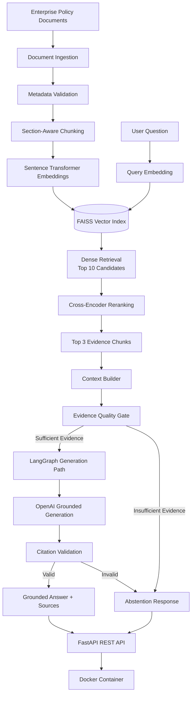

# Enterprise Knowledge Intelligence Platform

[](https://github.com/HANUMANTHTHOPURI/enterprise-knowledge-intelligence/actions/workflows/ci.yml)

A production-oriented **Enterprise Retrieval-Augmented Generation (RAG) platform** built with semantic retrieval, FAISS vector search, cross-encoder reranking, evidence validation, LangGraph-based agentic orchestration, OpenAI generation, FastAPI, Docker, automated evaluation, and CI.

The system is designed to answer enterprise policy questions only when sufficient evidence exists and to abstain when the knowledge base does not support an answer.

---

## Project Overview

Enterprise organizations often store critical knowledge across policy documents, procedures, security standards, financial guidelines, and compliance documentation.

This project implements an end-to-end AI knowledge platform that:

- Ingests enterprise documents and structured metadata
- Performs section-aware document chunking
- Generates dense semantic embeddings
- Stores and retrieves vectors using FAISS
- Reranks retrieval candidates using a cross-encoder
- Evaluates whether retrieved evidence is sufficient
- Uses LangGraph for conditional agentic execution
- Generates grounded answers with source citations
- Abstains when evidence is insufficient
- Exposes the system through a FastAPI REST API
- Runs inside Docker
- Includes automated retrieval and end-to-end RAG evaluation
- Uses GitHub Actions for continuous integration

---

## System Architecture



---

## Core AI Pipeline

### 1. Enterprise Document Ingestion

Each document includes structured metadata such as:

- Document ID
- Department
- Document type
- Version
- Effective date
- Access level
- Source file

The ingestion layer validates documents using Pydantic before they enter the retrieval pipeline.

### 2. Section-Aware Chunking

Rather than splitting documents at arbitrary character boundaries, the system detects numbered policy sections and preserves semantic structure.

The current enterprise corpus contains:

- **5 enterprise policy documents**
- **35 semantic chunks**
- **7 sections per document**

### 3. Dense Embeddings

Embedding model:

```text
sentence-transformers/all-MiniLM-L6-v2
```

Embedding dimension:

```text
384
```

Embeddings are normalized before similarity search.

### 4. FAISS Vector Retrieval

The system uses a persistent FAISS inner-product index for efficient semantic retrieval.

Generated vector-store artifacts:

```text
enterprise_knowledge.faiss
enterprise_knowledge_chunks.json
```

These artifacts are reproducibly generated from the source documents and are intentionally excluded from Git.

### 5. Cross-Encoder Reranking

Initial semantic retrieval returns the top **10 candidates**.

They are reranked using:

```text
cross-encoder/ms-marco-MiniLM-L-6-v2
```

The highest-ranked evidence chunks are then used for context construction.

### 6. Evidence Quality Gate

Before answer generation, an LLM-based evidence evaluator determines whether the retrieved context directly supports the user's question.

This prevents the generator from answering questions that are merely topically similar to the retrieved documents.

### 7. Agentic RAG with LangGraph

The RAG workflow uses conditional LangGraph execution:

```text
Retrieve
   ?
Build Context
   ?
Assess Evidence
   ?
   +-- Sufficient ? Generate ? Validate Citations ? Answer
   ¦
   +-- Insufficient ? Abstain
```

This implements two protection layers:

1. **Evidence Gate**
2. **Generation/Citation Gate**

---

## Retrieval Evaluation

Several retrieval strategies were evaluated using difficult semantic queries.

| Retrieval Strategy | Recall@1 | MRR@5 | Recall@5 |
|---|---:|---:|---:|
| Dense Retrieval | 0.8333 | 0.8981 | 1.0000 |
| Dense + Cross-Encoder Reranking | **0.8889** | **0.9444** | **1.0000** |

BM25 and hybrid reciprocal-rank fusion were also experimentally evaluated but did not outperform the dense retrieval + reranking configuration on the hard-query benchmark.

---

## End-to-End RAG Evaluation

A curated enterprise benchmark containing:

```text
10 questions
5 supported questions
5 unsupported questions
```

was used to evaluate the complete RAG pipeline.

Final benchmark results:

| Metric | Result |
|---|---:|
| Answer / Abstain Decision Accuracy | **1.0000** |
| Citation Accuracy | **1.0000** |
| Abstention Accuracy | **1.0000** |
| Mean Expected Keyword Coverage | **1.0000** |

These results represent **100% performance on the curated 10-query enterprise benchmark** and should not be interpreted as universal accuracy.

The evaluation workflow tests:

- Answer-vs-abstain decisions
- Citation correctness
- Unsupported-question abstention
- Expected keyword coverage

---

## FastAPI Interface

The platform exposes a REST API.

### Health Check

```http
GET /api/v1/health
```

### Readiness Check

```http
GET /api/v1/ready
```

### Ask a Question

```http
POST /api/v1/ask
```

Example request:

```json
{
  "question": "Can I work remotely from another country, and who must approve it?"
}
```

Example grounded response structure:

```json
{
  "question": "Can I work remotely from another country, and who must approve it?",
  "answer": "...",
  "sufficient_evidence": true,
  "sources": [],
  "latency_ms": 0
}
```

When the enterprise knowledge base does not contain sufficient information, the system returns an abstention response rather than inventing an answer.

---

## Technology Stack

### AI / Machine Learning

- Python 3.12
- Sentence Transformers
- Cross-Encoder Reranking
- FAISS
- OpenAI API
- LangGraph
- NumPy
- Scikit-learn

### Backend

- FastAPI
- Pydantic
- Uvicorn

### Retrieval / Evaluation

- Dense semantic retrieval
- BM25 experimentation
- Reciprocal Rank Fusion experimentation
- Recall@K
- Mean Reciprocal Rank
- Citation evaluation
- Abstention evaluation

### Engineering / Deployment

- Docker
- Git
- GitHub
- GitHub Actions
- Ruff
- Pytest

---

## Local Installation

Clone the repository:

```bash
git clone https://github.com/HANUMANTHTHOPURI/enterprise-knowledge-intelligence.git
cd enterprise-knowledge-intelligence
```

Create a virtual environment:

```bash
python -m venv .venv
```

Activate it on Windows:

```powershell
.venv\Scripts\Activate.ps1
```

Install the project and development dependencies:

```bash
pip install -e ".[dev]"
```

---

## Environment Configuration

Create a local `.env` file:

```text
OPENAI_API_KEY=your_key_here
```

The `.env` file is excluded from Git and should never be committed.

---

## Build the Vector Store

```bash
python scripts/build_vectorstore.py
```

Expected configuration:

```text
Documents:           5
Chunks:              35
Vectors:             35
Embedding dimension: 384
```

---

## Run the API Locally

```bash
python -m uvicorn app.main:app --host 127.0.0.1 --port 8000
```

Swagger documentation:

```text
http://127.0.0.1:8000/docs
```

---

## Docker Deployment

Build the Docker image:

```bash
docker build -t enterprise-knowledge-intelligence:1.0 .
```

Run the container:

```bash
docker run --rm \
  --name enterprise-knowledge-api \
  --env-file .env \
  -p 8000:8000 \
  enterprise-knowledge-intelligence:1.0
```

The container initializes the retrieval stack and serves the FastAPI application on port `8000`.

---

## Testing

Run the complete automated test suite:

```bash
pytest
```

Current test suite:

```text
71 tests
```

Run static code-quality checks:

```bash
ruff check app tests scripts
```

---

## Continuous Integration

GitHub Actions automatically executes the CI pipeline on pushes and pull requests to `main`.

The pipeline performs:

```text
Repository Checkout
        ?
Python 3.12 Setup
        ?
Dependency Installation
        ?
Ruff Static Analysis
        ?
Pytest Test Suite
```

A failed lint check or automated test causes the CI workflow to fail.

---

## Project Structure

```text
enterprise-knowledge-intelligence/
¦
+-- app/
¦   +-- agent/
¦   +-- api/
¦   +-- chunking/
¦   +-- core/
¦   +-- embeddings/
¦   +-- evaluation/
¦   +-- generation/
¦   +-- ingestion/
¦   +-- retrieval/
¦   +-- vectorstore/
¦
+-- data/
¦   +-- raw/
¦   +-- evaluation/
¦   +-- vectorstore/
¦
+-- notebooks/
¦
+-- reports/
¦   +-- figures/
¦
+-- scripts/
¦   +-- build_vectorstore.py
¦   +-- run_rag_benchmark.py
¦
+-- tests/
¦
+-- .github/
¦   +-- workflows/
¦       +-- ci.yml
¦
+-- Dockerfile
+-- .dockerignore
+-- .gitignore
+-- pyproject.toml
+-- README.md
```

---

## Engineering Decisions

Several design decisions were determined experimentally rather than assumed.

### Dense Retrieval vs Hybrid Search

BM25 and hybrid reciprocal-rank fusion were evaluated against dense semantic retrieval.

Dense retrieval performed better on the difficult enterprise semantic-query benchmark.

### Candidate Pool Optimization

Increasing the reranking candidate pool from:

```text
5 ? 10
```

recovered relevant evidence that had previously been missed before reranking.

### Evidence Calibration

The evidence evaluator was calibrated to judge whether the available sources answer the **actual level of detail requested by the user**, while continuing to reject unsupported specific facts.

This improved supported-query coverage without weakening unsupported-query abstention.

---

## Security and Reliability

The system incorporates several safeguards:

- API keys are excluded from source control
- Source documents are treated as evidence rather than instructions
- Retrieved content cannot override system instructions
- Unsupported questions trigger abstention
- Generated citation numbers are validated
- API logs avoid recording complete user questions and answers
- Vector indexes are reproducibly generated rather than committed
- Automated tests validate core system behavior

---

## Project Goal

This project demonstrates production-oriented skills relevant to:

- AI Engineer
- Generative AI Engineer
- Machine Learning Engineer
- LLM Engineer
- Applied AI Engineer
- Backend AI Engineer

It focuses not only on LLM generation, but also on retrieval quality, grounding, evaluation, observability, testing, API engineering, containerization, and deployment practices.

---

## Author

**Hanumanth Thopuri**

Master's in Artificial Intelligence  
Florida Atlantic University

GitHub: [HANUMANTHTHOPURI](https://github.com/HANUMANTHTHOPURI)
